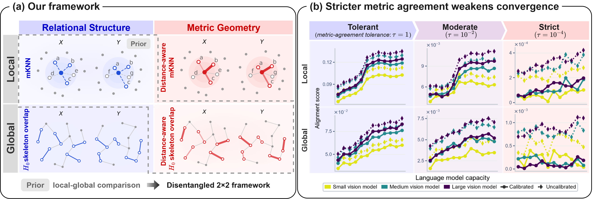

# What Converges in the Platonic Representation Hypothesis? Structure Over Geometry

Official implementation code for **“What Converges in the Platonic Representation Hypothesis? Structure Over Geometry.”**

This repository studies representational convergence along two separate axes: **structural scale** (local vs. global) and **what is compared** (relational structure vs. metric geometry). The main experiments pair local mutual k-nearest-neighbor (mKNN) alignment with global $H_0$ skeleton overlap, then introduce matched distance-aware variants.

## Abstract

The Platonic Representation Hypothesis suggests that increasingly capable models converge toward shared representations. 
Recent work narrows this claim to shared local neighborhood relationships, finding that capacity-dependent trends in several global similarity measures largely disappear after calibration.
We challenge this interpretation by showing that prior local-global comparisons confound structural scale (local versus global) with what is compared: relational structure, defined by which samples are related, versus metric geometry, characterized by quantitative relations such as distances, similarities, or correlations.
To disentangle these factors, we construct a controlled $2\times2$ framework that evaluates both relational structure and metric geometry at local and global scales. 
We introduce $H_0$ skeleton overlap as a global counterpart to mutual $k$-nearest neighbors, together with matched distance-aware variants.
Across vision-language models, relational structure exhibits robust representational convergence at both scales after calibration, whereas increasingly stringent distance agreement substantially weakens alignment and progressively flattens the capacity-dependent trend. 
We further extend the analysis beyond ambient Euclidean geometry by evaluating distance agreement under a Riemannian metric approximation and recover the same structure-geometry pattern.
The pattern is also reproduced in video-text representations. 
Together, these results show that relational convergence extends beyond local neighborhoods to global spanning structure, whereas metric geometry exhibits substantially weaker convergence.



## Repository structure

```text
aristotelian/        Core alignment, calibration, topology, and PRH utilities
runs/                Reproduction scripts for the experiments in the paper
scripts/             Experiment and plotting entry points
styles/              Matplotlib style used for paper figures
requirements.txt     Exact pinned environment used for reproduction
pyproject.toml       Package metadata and install configuration
```

The paper-specific reproduction entry points are the scripts in `runs/`.

## Installation

For exact reproduction of the reported experiments, create an isolated environment and install the pinned dependencies:

```bash
python -m venv .venv
source .venv/bin/activate
pip install -r requirements.txt
```

On Windows PowerShell, activate the environment with:

```powershell
.venv\Scripts\Activate.ps1
```

`requirements.txt` pins the reproduction environment, including the CUDA 11.8 PyTorch build used by this project. The experiments download public datasets and model checkpoints through Hugging Face and timm. Some checkpoints may require accepting the corresponding model license or authenticating with the hosting service.

For editable package installation after installing the pinned requirements:

```bash
pip install -e . --no-deps
```

## Reproducing the experiments

Run commands from the repository root so that relative paths such as `./results` and `assets/` resolve correctly.

```bash
bash runs/01_support_vision_language.sh
bash runs/02_distance_vision_language.sh
bash runs/03_normalization_robustness.sh
bash runs/04_similarity_robustness.sh
bash runs/05_riemannian_robustness.sh
bash runs/06_video_text.sh
bash runs/07_plot_results.sh
```

Set `DEVICE=cpu` or `DEVICE=cuda:0` to override the default CUDA device. For example:

```bash
DEVICE=cuda:0 bash runs/01_support_vision_language.sh
```

Intermediate feature caches are written under `results/features/`. Experiment outputs and generated plots are written under `assets/`.

Full reproduction is computationally expensive because the benchmark includes large checkpoints, including LLaMA-65B. Feature extraction is the dominant cost; cached features are reused by subsequent alignment and robustness runs when available.

## Model sets

The vision-language experiment uses 12 text models and 17 vision models defined in `aristotelian/prh/prh_models.py`.

The video-text experiment uses 13 text models—the same 12-model scaling set plus Gemma-2-9B-IT—and 11 visual/video models defined in `aristotelian/prh/prh_models.py` and `aristotelian/prh/video_models.py`.

## Code provenance

This repository retains components from the upstream [**Aristotelian PRH**](https://github.com/mlbio-epfl/Aristotelian). The corresponding MIT License and attribution are preserved in `LICENSE`.

## License

See [`LICENSE`](LICENSE) for license terms and preserved upstream attribution.

## Citation

BibTeX information can be added here once a public paper record is available.
